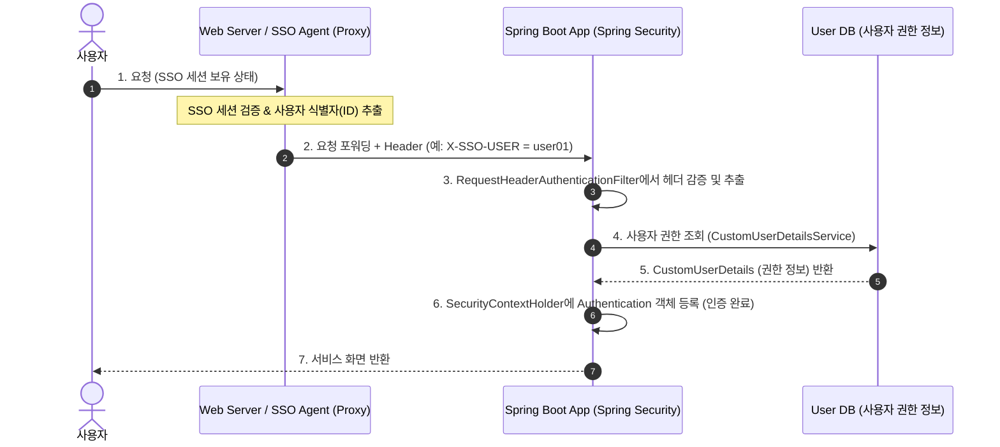
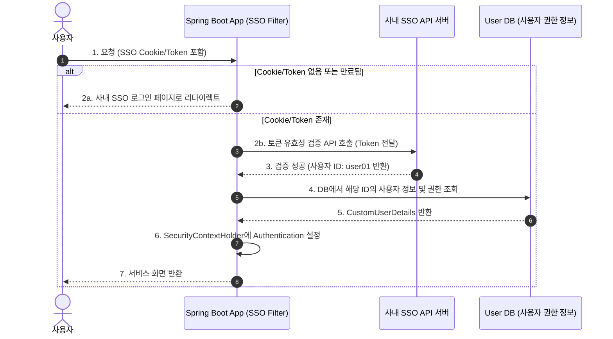

# Spring Security 기반 기업용 SSO 연동 가이드 (SSO Integration Guide)

현재 프로젝트는 `spring-boot-starter-security`를 사용하여 로그인 폼(`formLogin`)을 통해 사용자 ID/패스워드를 직접 검증하는 방식으로 구성되어 있습니다.  
패스워드를 직접 관리하지 않고 **사내 SSO(Single Sign-On)를 통해 인증 여부를 체크**하도록 변경하려면, 인증 주체(SSO)가 제공하는 연동 방식에 따라 Spring Security 설정을 수정해야 합니다.

사내 SSO 연동 방식은 크게 **3가지 유형**으로 나뉩니다. 기업 환경에서 가장 빈번하게 사용되는 방식들을 기준으로 구현 가이드를 제공합니다.

---

## 1. SSO 연동 방식 및 아키텍처 비교

### 유형 A: HTTP Request Header 기반 SSO (Pre-Authenticated)
* **특징**: 웹 서버(Apache, Nginx) 또는 SSO Agent(Siteminder, SafeIdentity 등)가 리버스 프록시 레벨에서 사용자를 인증한 후, WAS(Spring Boot)로 요청을 넘겨줄 때 특정 HTTP Header(예: `X-SSO-USER`)에 사용자 ID를 주입하는 방식입니다.
* **장점**: 개발 공수가 가장 적고, Spring Security의 `Pre-Authenticated Authentication` 기능을 그대로 활용할 수 있습니다.



---

### 유형 B: SSO Cookie/Token API 검증 기반 (Custom Filter)
* **특징**: 사용자가 브라우저에 가진 SSO 토큰/쿠키를 어플리케이션이 직접 감지한 뒤, 사내 SSO API 서버에 해당 토큰의 유효성을 검증(REST 호출 등)받는 방식입니다.
* **장점**: 프록시 설정이 불필요하며 애플리케이션 내에서 인증 프로세스를 직접 제어할 수 있습니다.



---

### 유형 C: 표준 OAuth2 / OpenID Connect (OIDC) 기반 SSO
* **특징**: OAuth2 인증 표준을 따르는 최신 SSO(Okta, Keycloak, Azure AD, 사내 OAuth Server 등) 연동 방식입니다.
* **장점**: Spring Security OAuth2 Client 라이브러리를 통해 표준적이고 안전한 리다이렉션 및 토큰 발급 흐름을 쉽게 연동할 수 있습니다.

---

## 2. 각 유형별 코드 수정 가이드

### 유형 A: HTTP Request Header 기반 SSO 구현 방법

Spring Security의 `RequestHeaderAuthenticationFilter`를 이용해 프록시가 제공하는 헤더 값을 기반으로 비밀번호 없이 인증을 통과시키는 방법입니다.

#### 1) SecurityConfig.java 수정
```java
package com.company.portal.config;

import com.company.portal.security.CustomUserDetailsService;
import org.springframework.context.annotation.Bean;
import org.springframework.context.annotation.Configuration;
import org.springframework.security.authentication.AuthenticationManager;
import org.springframework.security.authentication.ProviderManager;
import org.springframework.security.config.annotation.web.builders.HttpSecurity;
import org.springframework.security.config.annotation.web.configuration.EnableWebSecurity;
import org.springframework.security.web.SecurityFilterChain;
import org.springframework.security.web.authentication.preauth.PreAuthenticatedAuthenticationProvider;
import org.springframework.security.web.authentication.preauth.PreAuthenticatedAuthenticationToken;
import org.springframework.security.web.authentication.preauth.RequestHeaderAuthenticationFilter;
import org.springframework.security.web.authentication.preauth.UserDetailsByNameServiceWrapper;
import org.springframework.security.web.util.matcher.AntPathRequestMatcher;

import java.util.Collections;

@Configuration
@EnableWebSecurity
public class SecurityConfig {

    private final CustomUserDetailsService userDetailsService;

    public SecurityConfig(CustomUserDetailsService userDetailsService) {
        this.userDetailsService = userDetailsService;
    }

    // 1. 헤더 기반 인증 필터 등록
    @Bean
    public RequestHeaderAuthenticationFilter requestHeaderAuthenticationFilter(AuthenticationManager authenticationManager) {
        RequestHeaderAuthenticationFilter filter = new RequestHeaderAuthenticationFilter();
        filter.setPrincipalRequestHeader("X-SSO-USER"); // 사내 SSO가 헤더에 담아주는 사용자 ID 키값 설정
        filter.setExceptionIfHeaderMissing(false);     // 로컬 테스트 등을 위해 헤더가 없어도 예외 발생 방지
        filter.setAuthenticationManager(authenticationManager);
        return filter;
    }

    // 2. 패스워드 없이 UserDetailsService만으로 인증을 수행할 Provider 설정
    @Bean
    public PreAuthenticatedAuthenticationProvider preAuthenticatedAuthenticationProvider() {
        PreAuthenticatedAuthenticationProvider provider = new PreAuthenticatedAuthenticationProvider();
        provider.setPreAuthenticatedUserDetailsService(new UserDetailsByNameServiceWrapper<>(userDetailsService));
        return provider;
    }

    @Bean
    public AuthenticationManager authenticationManager() {
        return new ProviderManager(Collections.singletonList(preAuthenticatedAuthenticationProvider()));
    }

    @Bean
    public SecurityFilterChain filterChain(HttpSecurity http, RequestHeaderAuthenticationFilter ssoFilter) throws Exception {
        http
            .authorizeHttpRequests(authorize -> authorize
                .requestMatchers(new AntPathRequestMatcher("/h2-console/**")).permitAll()
                .requestMatchers(new AntPathRequestMatcher("/")).permitAll()
                .requestMatchers(new AntPathRequestMatcher("/css/**")).permitAll()
                .requestMatchers(new AntPathRequestMatcher("/js/**")).permitAll()
                .requestMatchers(new AntPathRequestMatcher("/images/**")).permitAll()
                .anyRequest().authenticated()
            )
            // 3. 기존의 formLogin() 대신 SSO 헤더 필터를 로그인 필터 전단계에 추가
            .addFilterBefore(ssoFilter, RequestHeaderAuthenticationFilter.class)
            .csrf(csrf -> csrf.disable())
            .headers(headers -> headers.frameOptions().disable());

        return http.build();
    }
}
```

> [!NOTE]
> 이 방식은 SSO 솔루션/프록시 서버가 직접 인증을 수행하여 패스워드 없이 헤더만 주입하므로, `PasswordEncoder`와 `formLogin` 설정은 더 이상 사용되지 않습니다.

---

### 유형 B: Cookie/Token API 검증 기반 (Custom Filter) 구현 방법

사용자의 Cookie/Token을 추출해 외부 SSO API에 전송하여 인증하는 Custom Filter를 정의하고 체인에 삽입합니다.

#### 1) Custom SSO Filter 생성 (`SSOAuthenticationFilter.java`)
```java
package com.company.portal.security;

import jakarta.servlet.FilterChain;
import jakarta.servlet.ServletException;
import jakarta.servlet.http.Cookie;
import jakarta.servlet.http.HttpServletRequest;
import jakarta.servlet.http.HttpServletResponse;
import org.springframework.security.authentication.UsernamePasswordAuthenticationToken;
import org.springframework.security.core.context.SecurityContextHolder;
import org.springframework.security.core.userdetails.UserDetails;
import org.springframework.web.filter.OncePerRequestFilter;

import java.io.IOException;
import java.util.Arrays;

public class SSOAuthenticationFilter extends OncePerRequestFilter {

    private final CustomUserDetailsService userDetailsService;
    // private final SsoClient ssoClient; // SSO 검증 클라이언트 API

    public SSOAuthenticationFilter(CustomUserDetailsService userDetailsService) {
        this.userDetailsService = userDetailsService;
    }

    @Override
    protected void doFilterInternal(HttpServletRequest request, HttpServletResponse response, FilterChain filterChain)
            throws ServletException, IOException {

        // 1. 쿠키에서 SSO 토큰 획득 (예: SSO_SESSION_TOKEN)
        String ssoToken = null;
        if (request.getCookies() != null) {
            ssoToken = Arrays.stream(request.getCookies())
                    .filter(cookie -> "SSO_SESSION_TOKEN".equals(cookie.getName()))
                    .map(Cookie::getValue)
                    .findFirst()
                    .orElse(null);
        }

        if (ssoToken != null && SecurityContextHolder.getContext().getAuthentication() == null) {
            // 2. 사내 SSO 서버 API 호출로 토큰 검증 및 사용자 ID 획득
            String username = validateSsoTokenWithExternalApi(ssoToken); 

            if (username != null) {
                // 3. 내부 DB에서 사용자 권한 로드
                UserDetails userDetails = userDetailsService.loadUserByUsername(username);

                // 4. 비밀번호 없이 Security Context에 인증 객체 강제 주입
                UsernamePasswordAuthenticationToken authentication = 
                        new UsernamePasswordAuthenticationToken(userDetails, null, userDetails.getAuthorities());
                
                SecurityContextHolder.getContext().setAuthentication(authentication);
            } else {
                // 토큰이 유효하지 않을 경우 SSO 로그인 페이지로 리다이렉트
                response.sendRedirect("https://sso.company.com/login?redirect_uri=" + request.getRequestURL());
                return;
            }
        } else if (ssoToken == null && !isExcludedPath(request.getRequestURI())) {
            // 토큰이 없는데 보호된 리소스에 접근하는 경우 SSO 로그인 페이지로 이동
            response.sendRedirect("https://sso.company.com/login?redirect_uri=" + request.getRequestURL());
            return;
        }

        filterChain.doFilter(request, response);
    }

    private String validateSsoTokenWithExternalApi(String token) {
        // TODO: 실제 사내 SSO API를 연동하여 토큰 유효성 검사 후 사용자 ID(username) 반환하도록 구현
        // 예시: return restTemplate.postForObject("https://sso.company.com/api/verify", token, String.class);
        return "user01"; // Mocking
    }

    private boolean isExcludedPath(String path) {
        return path.startsWith("/css/") || path.startsWith("/js/") || path.startsWith("/images/") || path.startsWith("/h2-console");
    }
}
```

#### 2) SecurityConfig.java 수정
```java
package com.company.portal.config;

import com.company.portal.security.CustomUserDetailsService;
import com.company.portal.security.SSOAuthenticationFilter;
import org.springframework.context.annotation.Bean;
import org.springframework.context.annotation.Configuration;
import org.springframework.security.config.annotation.web.builders.HttpSecurity;
import org.springframework.security.config.annotation.web.configuration.EnableWebSecurity;
import org.springframework.security.web.SecurityFilterChain;
import org.springframework.security.web.authentication.UsernamePasswordAuthenticationFilter;
import org.springframework.security.web.util.matcher.AntPathRequestMatcher;

@Configuration
@EnableWebSecurity
public class SecurityConfig {

    private final CustomUserDetailsService userDetailsService;

    public SecurityConfig(CustomUserDetailsService userDetailsService) {
        this.userDetailsService = userDetailsService;
    }

    @Bean
    public SecurityFilterChain filterChain(HttpSecurity http) throws Exception {
        http
            .authorizeHttpRequests(authorize -> authorize
                .requestMatchers(new AntPathRequestMatcher("/h2-console/**")).permitAll()
                .requestMatchers(new AntPathRequestMatcher("/css/**")).permitAll()
                .requestMatchers(new AntPathRequestMatcher("/js/**")).permitAll()
                .requestMatchers(new AntPathRequestMatcher("/images/**")).permitAll()
                .anyRequest().authenticated()
            )
            // Custom SSO Filter를 UsernamePasswordAuthenticationFilter 이전에 등록
            .addFilterBefore(new SSOAuthenticationFilter(userDetailsService), UsernamePasswordAuthenticationFilter.class)
            .csrf(csrf -> csrf.disable())
            .headers(headers -> headers.frameOptions().disable());

        return http.build();
    }
}
```

---

### 유형 C: 표준 OAuth2 / OIDC Client 구현 방법

OAuth2 표준 사양의 사내 SSO가 제공되는 경우, Spring Security가 자체 제공하는 `spring-boot-starter-oauth2-client`를 활용하는 것이 바람직합니다.

#### 1) `pom.xml`에 의존성 추가
```xml
<dependency>
    <groupId>org.springframework.boot</groupId>
    <artifactId>spring-boot-starter-oauth2-client</artifactId>
</dependency>
```

#### 2) `application.properties`에 OAuth2 Client 정보 구성
```properties
# OAuth2 Client 설정 (사내 SSO 정보 입력)
spring.security.oauth2.client.registration.company-sso.client-id=YOUR_CLIENT_ID
spring.security.oauth2.client.registration.company-sso.client-secret=YOUR_CLIENT_SECRET
spring.security.oauth2.client.registration.company-sso.scope=openid,profile,email
spring.security.oauth2.client.registration.company-sso.authorization-grant-type=authorization_code
spring.security.oauth2.client.registration.company-sso.redirect-uri={baseUrl}/login/oauth2/code/{registrationId}

spring.security.oauth2.client.provider.company-sso.authorization-uri=https://sso.company.com/oauth/authorize
spring.security.oauth2.client.provider.company-sso.token-uri=https://sso.company.com/oauth/token
spring.security.oauth2.client.provider.company-sso.user-info-uri=https://sso.company.com/oauth/userinfo
spring.security.oauth2.client.provider.company-sso.user-name-attribute=sub
```

#### 3) SecurityConfig.java 수정
```java
package com.company.portal.config;

import org.springframework.context.annotation.Bean;
import org.springframework.context.annotation.Configuration;
import org.springframework.security.config.annotation.web.builders.HttpSecurity;
import org.springframework.security.config.annotation.web.configuration.EnableWebSecurity;
import org.springframework.security.web.SecurityFilterChain;
import org.springframework.security.web.util.matcher.AntPathRequestMatcher;

@Configuration
@EnableWebSecurity
public class SecurityConfig {

    @Bean
    public SecurityFilterChain filterChain(HttpSecurity http) throws Exception {
        http
            .authorizeHttpRequests(authorize -> authorize
                .requestMatchers(new AntPathRequestMatcher("/h2-console/**")).permitAll()
                .requestMatchers(new AntPathRequestMatcher("/css/**")).permitAll()
                .requestMatchers(new AntPathRequestMatcher("/js/**")).permitAll()
                .requestMatchers(new AntPathRequestMatcher("/images/**")).permitAll()
                .anyRequest().authenticated()
            )
            // OAuth2 로그인 활성화
            .oauth2Login(oauth2 -> oauth2
                .defaultSuccessUrl("/main")
            )
            .csrf(csrf -> csrf.disable())
            .headers(headers -> headers.frameOptions().disable());

        return http.build();
    }
}
```

---

## 3. 핵심 고려사항 및 주의점

1. **UserDetailsService와 권한 동기화**:
   * SSO 인증을 받으면 로그인 과정은 SSO 서버에서 끝나지만, 서비스 내에서 필요한 권한(Role)은 여전히 사내 DB의 사용자 정보를 참조해야 할 수 있습니다. 
   * 위 예제코드처럼 SSO 인증 완료 후 획득한 `username`을 기준으로 `CustomUserDetailsService`를 호출하여 로컬 DB의 권한 정보를 `SecurityContext`에 채워주는 설계가 일반적입니다.

2. **패스워드 필드 처리**:
   * DB의 User 테이블 구조상 패스워드 컬럼(`password`)이 Non-Null 제약조건이거나 `UserDetails`에서 `getPassword()`를 필수로 구성해야 하는 경우, DB의 패스워드 필드는 임의의 고정난수나 UUID 등으로 설정해 두거나 사용하지 않음으로 비워두시면 됩니다. (SSO 연동 시 패스워드 검증 로직 자체를 거치지 않기 때문입니다.)

3. **로컬 개발 환경에서의 로그인 우회 (Mocking)**:
   * 로컬 개발 PC에서는 사내 SSO 망에 접근하기 어렵거나 프록시 세팅이 번거로울 수 있습니다.
   * `spring.profiles.active=dev`와 같은 개발 환경 프로파일을 활용하여, 개발 모드일 때만 로그인 폼(`formLogin`) 혹은 고정된 테스트 계정으로 자동 로그인해 주는 Mock Filter를 구성하여 분기 처리하는 것을 권장합니다.
